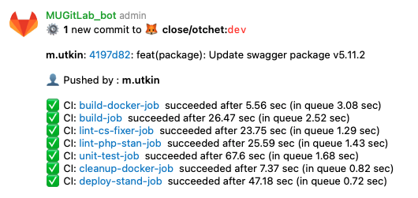
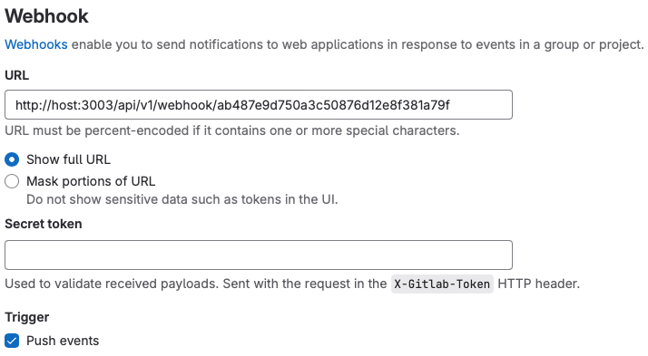

# Gitlab webhook notifications
#### Gitlab notification via telegram bot



## Install
```bash
composer create-project larahook/gitlab-notification
```

## Run project

### Add channel and bot props to project .env file

Copy .env.example file to .env
```bash
cp .env.example .env
```

Update config
```dotenv
# Telegram
TELEGRAM_BOT_HOST=https://api.telegram.org/bot
TELEGRAM_BOT_TOKEN=bot_id:token
TELEGRAM_BOT_TIMEOUT=7
TELEGRAM_HASH_CHAT_IDS=some_hash_1:-1001234567890;some_hash_2:some_chat_id_2

# Outgoing Rate limiter: 20rpm
RATE_LIMITER_ALLOW=20
RATE_LIMITER_EVERY_SECONDS=60
RATE_LIMITER_RELEASE_AFTER_SECONDS=15

# Host settings
APP_HTTP_PORT=3003
```

### Docker
```dockerfile
docker-compose up -d
docker exec -it gitlab-notification-app composer install
docker exec -it gitlab-notification-app php artisan migrate
```

### Gitlab

#### Allow requests to the local network

- Admin Area -> Settings -> Network -> Outbound requests
```
[x] Allow requests to the local network from webhooks and integrations
```

#### Add URL to Gitlab Webhook Settings

- Settings ->  Webhooks  ->  Add new webhook

Webhook URL example
```
http://host:3003/api/v1/webhook/some_hash_1
```


